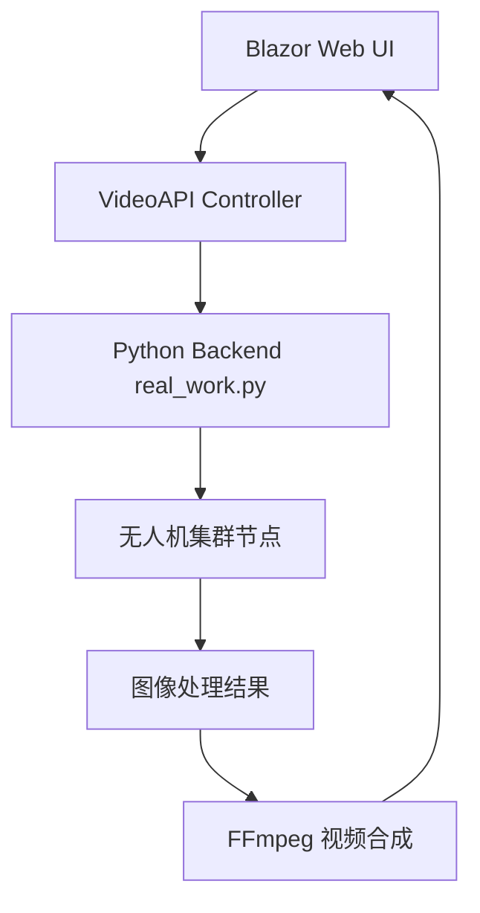

# .NET Blazor Web 与 Python 后端集成指南

## 🎯 项目概述

本项目实现了 .NET Blazor Web 前端与 Python 后端(`real_work.py`)的完整集成，支持视频处理任务的分发、监控和结果整合。

## 🏗️ 系统架构



## 📁 项目结构

```
AspireApp-asd/
├── BlazorApp_Web/
│   ├── Components/Pages/
│   │   ├── Task_Manage.razor              # 智能任务管理系统（整合视频处理功能）

│   ├── Controllers/
│   │   ├── VideoAPIController.cs         # 视频API控制器
│   │   └── ImageProcessingController.cs  # 图像处理控制器
│   ├── Service/

│   └── appsettings.json                  # 配置文件
├── linux_code/
│   ├── real_work.py                      # Python后端主文件
│   ├── process_faces.py                  # 人脸识别处理
│   ├── process_objects.py                # 物体检测处理
│   └── process_mixed.py                  # 混合处理
└── README_Integration.md                 # 本文档
```

## 🔧 配置说明

### 1. Python 后端配置

在 `linux_code/real_work.py` 中，确保以下配置正确：

```python
machine_ip = "192.168.31.35"    # Python后端IP
UI_ip = "192.168.31.93"         # Blazor Web UI IP  
alg_ip = "192.168.31.35"        # 算法服务IP
UI_port = 5009                  # UI端口
```

### 2. .NET 前端配置

Python后端连接配置已直接集成到 VideoAPIController 中，默认连接到 `192.168.31.35:5007`。

## 🚀 启动步骤

### 1. 启动 Python 后端

```bash
cd linux_code
python real_work.py
```

Python后端将在端口 `5007` 监听连接。

### 2. 启动 .NET Blazor Web

```bash
cd BlazorApp_Web/BlazorApp_Web
dotnet run
```

Web应用将在 `https://localhost:5001` 或 `http://localhost:5000` 启动。

### 3. 访问智能任务管理系统

打开浏览器访问：`https://localhost:5001/task_manage` 或 `https://localhost:5001/video-processing`

## 📋 功能特性

### 🎬 视频处理工作流

1. **上传视频**: 支持 MP4, AVI, MOV, MKV 格式
2. **任务创建**: 自动分解为100个子任务
3. **分布式处理**: 通过无人机集群并行处理
4. **实时监控**: 任务进度和状态实时更新
5. **结果整合**: 将处理后的图片合成为视频

### 🛠️ 支持的处理类型

- **人脸识别** (`face`): 使用 `process_faces.py`
- **物体检测** (`object`): 使用 `process_objects.py`  
- **混合处理** (`mixed`): 使用 `process_mixed.py`

### 🖥️ 界面功能

#### 1. 集群状态监控
- 显示总节点数和活跃节点数
- 集群分布信息
- 节点启动/关闭控制

#### 2. 任务管理
- 视频文件上传
- 任务名称自定义
- 处理类型选择
- 任务状态实时监控

#### 3. 结果查看
- 处理进度可视化
- 子任务完成情况
- 处理后图片预览
- 视频生成和下载

## 🔌 API 端点

### VideoAPI Controller

| 方法 | 端点 | 描述 |
|------|------|------|
| GET | `/api/videoapi/cluster-status` | 获取集群状态 |
| POST | `/api/videoapi/start-nodes` | 启动节点 |
| POST | `/api/videoapi/create-task` | 创建处理任务 |
| GET | `/api/videoapi/task-status/{taskName}` | 获取任务状态 |
| GET | `/api/videoapi/processed-images/{taskName}` | 获取处理后图片 |
| POST | `/api/videoapi/generate-video` | 生成视频 |
| POST | `/api/videoapi/shutdown-node` | 关闭节点 |

## 💡 Python 后端消息协议

### 1. 节点信息查询
```json
{
  "type": "node_info",
  "content": "",
  "next_node": ""
}
```

### 2. 启动所有节点
```json
{
  "type": "start_all",
  "content": 5,
  "next_node": ""
}
```

### 3. 创建任务
```json
{
  "type": "create_tasks", 
  "content": "/path/to/video.mp4",
  "next_node": "task_name"
}
```

### 4. 关闭节点
```json
{
  "type": "shutdown",
  "content": "node_name",
  "next_node": ""
}
```

## 🎞️ 视频生成流程

1. **图像收集**: Python后端处理完成后，图片保存到指定目录
2. **状态检测**: .NET前端通过API检测任务完成状态
3. **视频合成**: 使用 FFmpeg 将图片序列合成为视频
4. **结果展示**: 提供视频下载链接和在线预览

### FFmpeg 命令示例
```bash
ffmpeg -y -r 30 -i "/path/to/images/%04d.png" -c:v libx264 -pix_fmt yuv420p "/path/to/output.mp4"
```

## 🛡️ 错误处理

### 常见问题和解决方案

1. **Python后端连接失败**
   - 检查IP地址和端口配置
   - 确保防火墙允许连接
   - 验证Python后端是否正常运行

2. **视频上传失败**
   - 检查文件大小限制(默认500MB)
   - 确保支持的视频格式
   - 验证存储空间是否足够

3. **任务处理超时**
   - 检查无人机节点状态
   - 监控系统资源使用情况
   - 调整超时配置

4. **视频生成失败**
   - 确保系统安装了FFmpeg
   - 检查图片文件完整性
   - 验证输出路径权限

## 🔍 调试和监控

### 日志查看
- **Python后端**: 控制台输出和日志文件
- **.NET前端**: ILogger 输出到控制台和文件
- **浏览器**: 开发者工具 Console 和 Network 标签

### 性能监控
- 任务处理时间统计
- 节点资源使用情况
- 网络连接状态

## 🚦 部署建议

### 开发环境
- 使用模拟数据进行测试 (`UseMockData: true`)
- 启用详细日志记录
- 保持所有服务在本地运行

### 生产环境
- 配置真实的Python后端连接
- 启用HTTPS和安全认证
- 配置负载均衡和故障转移
- 设置监控和告警系统

## 📞 支持

如有问题，请检查：
1. 配置文件是否正确
2. 网络连接是否正常
3. 相关服务是否启动
4. 日志中的错误信息

---

**注意**: 确保在使用前已正确安装所有依赖项，包括FFmpeg、Python相关包和.NET运行时。 